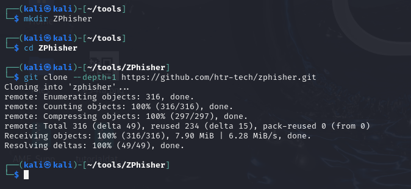
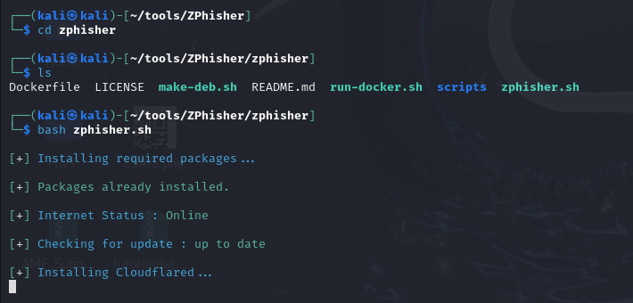
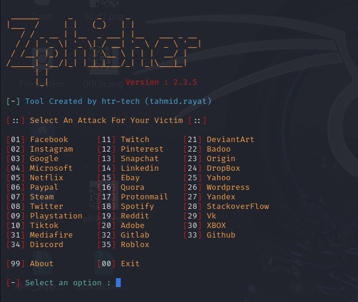
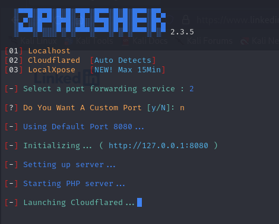
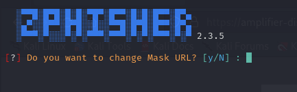
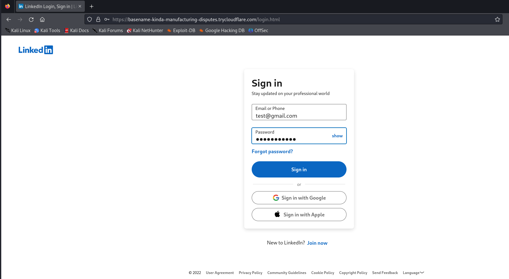
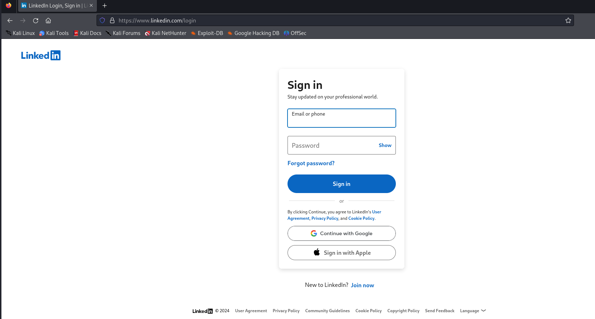
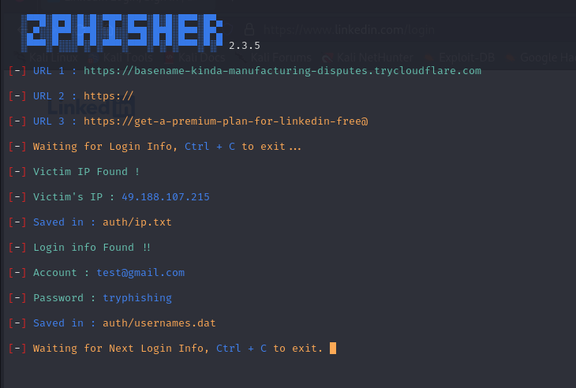
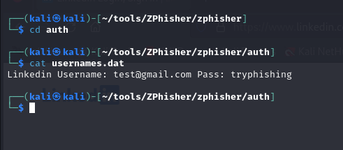

## ZPhisher Simulation

### Description
ZPhisher is a phishing tool that's easy to use. It may seem simple, but it has enough features to create effective phishing simulations, making it a useful tool for beginners.  

ZPhisher Documentation: https://github.com/htr-tech/zphisher?tab=readme-ov-file#dependencies

### Walkthrough
1. **Create a New Directory and Clone the Project**  
   I started by creating a new directory and then cloned the project from the ZPhisher repository.  
   
2. Once inside the directory, I ran the zphisher.sh script to start the tool.  
   
3. Next, I selected the platform template I wanted to phish, such as LinkedIn, Facebook, or Instagram.    
   
4. For this demonstration, I chose LinkedIn and used Cloudflared as the port forwarding service.  
   
5. Changing the mask URL is optional, but if you have your own domain, you can use it to make the phishing attempt more convincing.
   
6. The tool provides some URLs that you can use to target your victim. When the victim visits the URL, they will see a fake LinkedIn login page.
   
7. When the victim signs in, they will be redirected to the real LinkedIn login page. However, by that time, their credentials will have already been captured.  
   
8. The captured credentials are saved in `auth/usernames.dat`, and the victim's IP address is saved in `auth/ip.txt`. The credentials entered during the simulation (Account: **test@gmail.com** and Password: **tryphishing**) are displayed in plain text.  
   
9. We can check **usernames.dat** to view all the captured credentials.  
     
